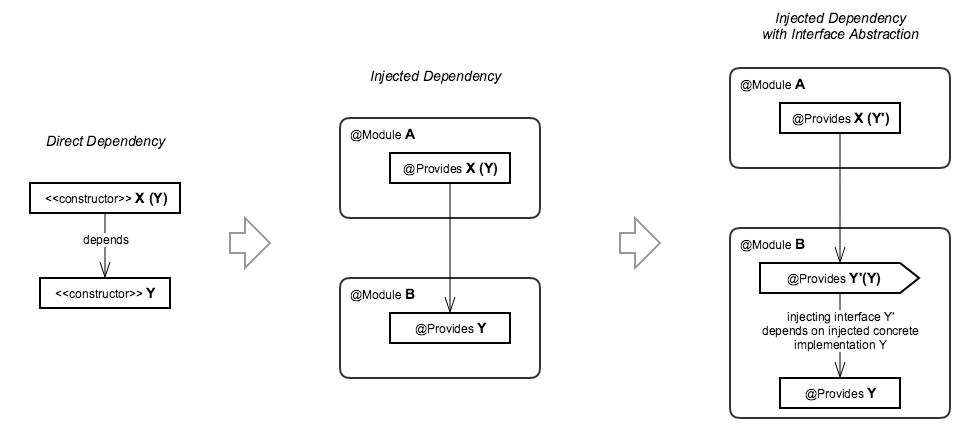
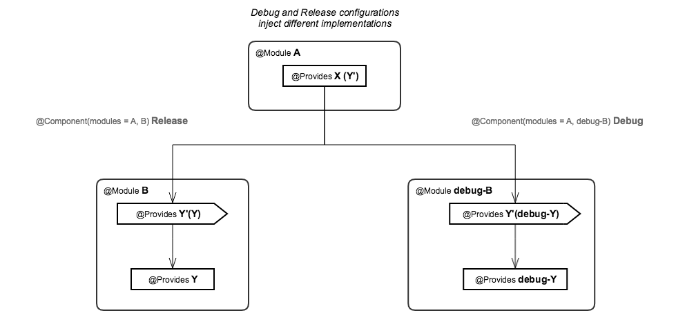
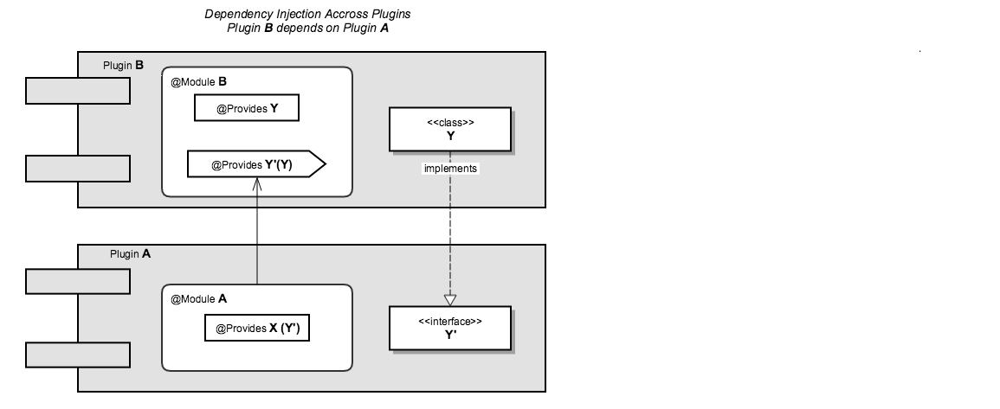
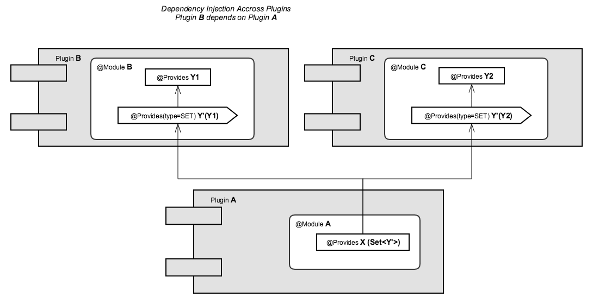
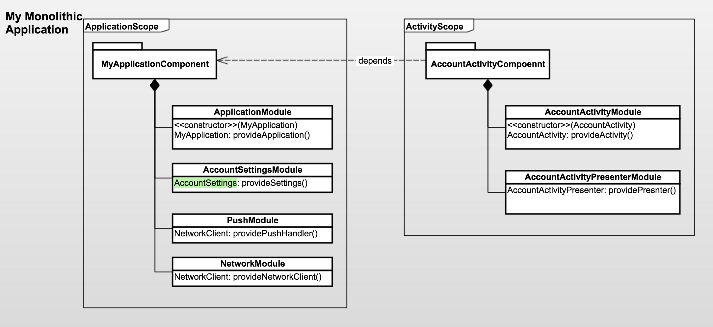
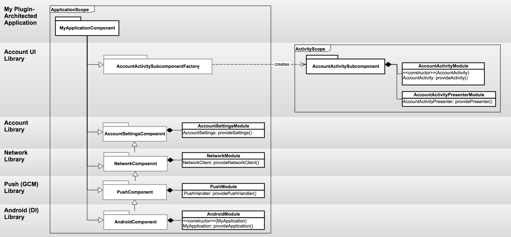
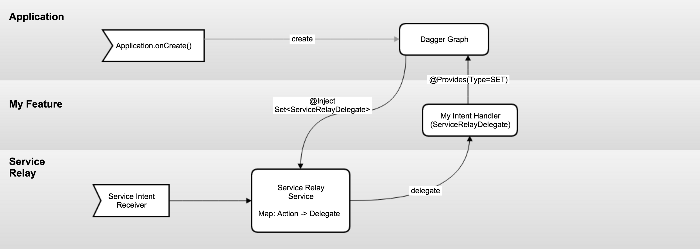

# Plugin Architecture for Android
## Motivation
- Break up the increasing complexity in Apps into managable chunks.
- Enable parallel development on various app components.
- Build encapsulated components that can be reused between apps.
- Minimize boilerplate and repeated glue code including Android schema declarations.

The existing model for breaking an Android App into smaller components is to create Android services, and content providers, and access them using IPC.  Using IPC is inconvenient because it requries marshalling data thus restricting use of plain java objects, and creates possible security vulnerabilities.  

A light-weight plugin architecture framework build on Dagger 2 allows an app to be broken up into an arbitrary number of libraries with well-defined APIs and dependencies.  Dependency Injection using Dagger does most of the hard work to ensure that dependencies are directed one way between plugins.  This project provides a way for Dagger 2 to be used accross library and app projects to eliminate the glue code that is typically needed in the application project in order to inject dependencies into libraries.  With better encapsulation, plugins can be build on other plugins to implement full application functionality with only a thin application project to pull them together.

## From Dependency Injection to Plugins
With dependency injection we pass control of resolving depdencies needed by components to a central framework.  The last step in the this progression introduces an interface: Y' which allows the injected dependency Y to be substituted with another implementation. 

### Debug Configuration
 The typical use case for this pattern is to allow test and debug configuration of the application to inject stub implementations of modules.

### Plugins
To build a plugin-architected application, we use the DI framework to decouple the interface and its implemetation so that a Plugin could be reused in different applications.

### Extensoin Points
A more powerful use of DI is to have a plugin declare an interface and an injection point that multiple plugins contribute to.  This extension interface can be used to delegate control from the base plugin to other plugins that build on top of its functioanlity.  A typical use case is for this mechanism is to off-load listener management to the framework with the added benefit that all the injected listeners are guaranteed to be registered at creation time. 

## Using Dagger 2 in Library Projects
Dagger 2 was not explicitly designed to be implemented across multiple modules (sub-projects, or libraries).  The example below shows how to force Dagger to fit our use case.

### (Example) Single-project Dagger 2 Application Structure 

Graph above shows a typical Object Graph structure in an application using Dagger 2.  It has the following features:
- The MyApplicationComponent interface, which has the [@Component](http://google.github.io/dagger/api/2.0/dagger/Component.html) annotation, encapsulates the graph of objects that exist for the duration of the application.
  - The @ApplicationScope is a [@Scope](https://docs.oracle.com/javaee/6/api/javax/inject/Scope.html)-type annotation which marks the MyApplicationComponent as well as the objects injected by its modules as having a common life-cycle (i.e. duration of the application).
  - ApplicationModule, AccountSettingsModule, etc, have the [@Module](http://google.github.io/dagger/api/2.0/dagger/Module.html) annotation, which tells Dagger to process these interfaces as providers of injectable types.
  - ApplicationModule requires the MyApplication reference when it is created.  This object is created by the android framework and must be supplied to the Dagger graph at its creation.
- The AccountActivityComponent is another object graph in the application (it has the @Component annotation). 
  - It encapsulates the object graph that is created for the life of the AccountActivity.  I.e. it is destroyed when user exits the Activity.
  - It has a dependency on MyApplicationComponent, which means that objects injected with this graph, can inject objects belonging to the MyApplicationComponent graph.
  - AccountActivityModule and AccountActivityPresenter modules share the ActivityScope, which binds the life-cycle of the injected types to the activity.
  - AccountActivityModule requires the AccountActivity reference when it is created.  This object, like MyApplication, is also created by the android framework and thus, it must be also supplied to the Dagger when the AccountActivityComponent sub-graph is created.

### Plugin Architected Application with Multiple Modules, using Dagger 2

In order to make Dagger 2 compatible with our requirement of splitting the application into modules, we have to make some restrictions on how we use it:
Libraries cannot create the ApplicationScope graph.  
- Only the top-level android application project, which implements the [Application](http://developer.android.com/reference/android/app/Application.html) object can create this graph.
- Libraries must use a interfaces to access objects that are held by the ApplicationScope object graph.  These interface can be declared by the libraries: ApplicationComponet, PushComponent, etc., and can depend on other Component interfaces.
- The top-level ApplicationScope component, MyApplicationComponent interface, must extend (with java extends) all the component interfaces declared in the libraries.
- The top-level MyApplicationComponent component must also declare all the libraries Dagger 2 [modules](http://google.github.io/dagger/api/2.0/dagger/Component.html#modules()) that the library components require.  Without them the Dagger compiler will fail.
- Sub-graphs, such as AccountActivitySubcomponent must be declared as a [http://google.github.io/dagger/api/2.0/dagger/Subcomponent.html](@Subcomponent), rather than as a component [dependency](http://google.github.io/dagger/api/2.0/dagger/Component.html#dependencies()).  This is because the dependency requires knowing the name of the final Dagger component that is depended on, which must be declared in the application project and is not accessible in the library project.
 
## Plugin Initialization
Many plugins need to perform some initialization when the application starts, such as initializing a GCM push token.  The PluginRegistry (TODO: link)  and the Plugin (TODO: link) interface provide a mechanism to achieve this initialization.  The PluginRegistry.onApplicationCreate() needs to be manually invoked from the Applications's onCreate() method, which in turns calls the Plugin.onApplicationCreate() methods of the contributed Plugin instances.  The Plugin instances are contributed to the registry through the dagger [@Provides.Type.SET](http://google.github.io/dagger/api/2.0/dagger/Provides.Type.html#SET) contribution.  By the time the Plugins' onApplicationCreate() methods are called the full dagger graph is initialized and accessible.  Plugins are called in the main looper and not in any particular order and should schedule any significant work to run in a service.

## Service Relay
An example of use case of the plugin paradigm: ServiceRelay is a uses an Android service which can be shared by multiple plugins:

1. Plugins use ServiceRelay by contributing ServiceRelayDelegate implementations through [@Provides.Type.SET](http://google.github.io/dagger/api/2.0/dagger/Provides.Type.html#SET).
2. Clients invoke the ServicerRelay service via an intent created using ServiceRelayIntentFactory, and a custom action ID.
3. ServiceRelay receives the intent and relays the intent to the correct delegate based on the delegates' registered action IDs.
4. When service delegate completes it calls the ServiceRelayDelegate.Controller.stopSelf(), just like with a regular android service.
